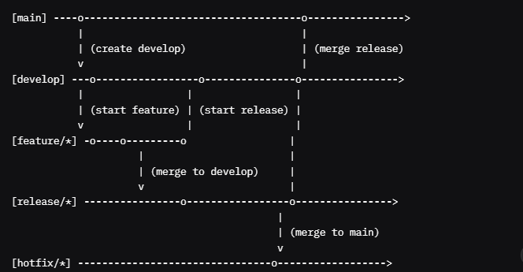
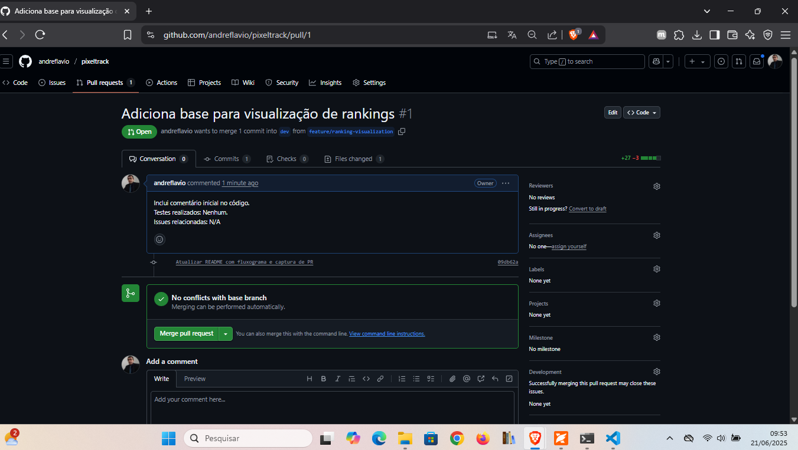
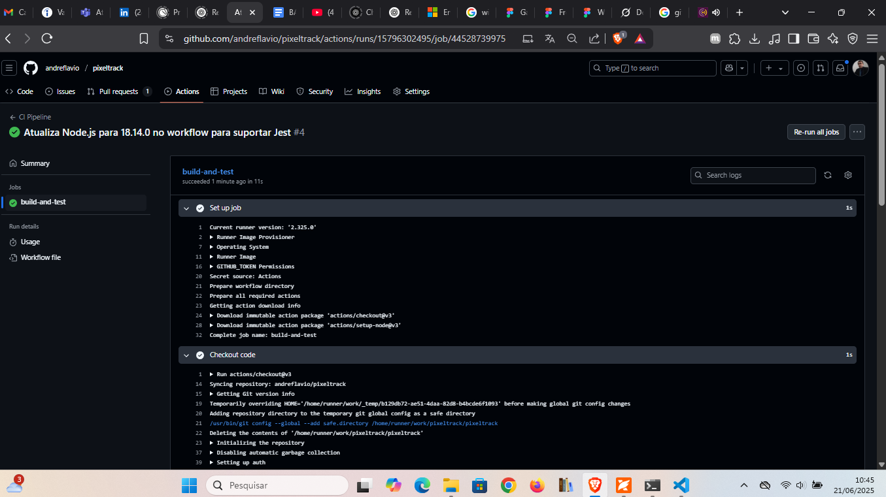
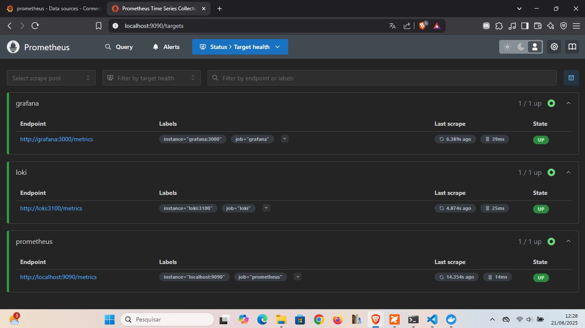
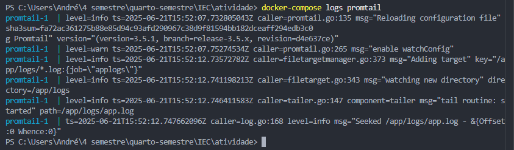
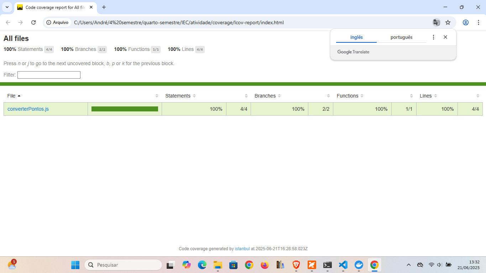

# PixelTrack

Projeto de painel interativo para dados estatísticos de eSports.

## Configuração do Git Flow

- main: Código estável.
- dev: Integração de features.
- feature/: Novas funcionalidades (ex.: feature/ranking-visualization).
- release/: Preparação de lançamentos.
- hotfix/: Correções urgentes.

### Comandos

- Inicializar: `git init`
- Configurar Git Flow: `git flow init`
- Criar feature: `git flow feature start ranking-visualization`
- Commit: `git commit -m "Adicionar função converterPontos"`
- Push: `git push origin feature/ranking-visualization`
- Evitar conflitos: `git pull --rebase origin dev`

### Boas Práticas

- Commits: Mensagens claras, commits atômicos.
- Pull Requests: Revisão via PRs no GitHub.

### Fluxograma

### Capturas de Tela

### Cobertura de Testes

Cobertura atual: 100% (Statements, Branches, Functions, Lines). Veja o [Relatório Completo](coverage/lcov-report/index.html).

### Monitoramento e Logging

A aplicação usa Docker Compose com Prometheus, Grafana, Loki e Promtail. Acesse o dashboard em [http://localhost:3001](http://localhost:3001). Capturas:

- 
- 

## Deploy Automatizado com Firebase

Deploy contínuo via GitHub Actions para Firebase Hosting:

- Configuração: `firebase.json` e `deploy.yml`.
- Rollback: `firebase hosting:rollback`.
